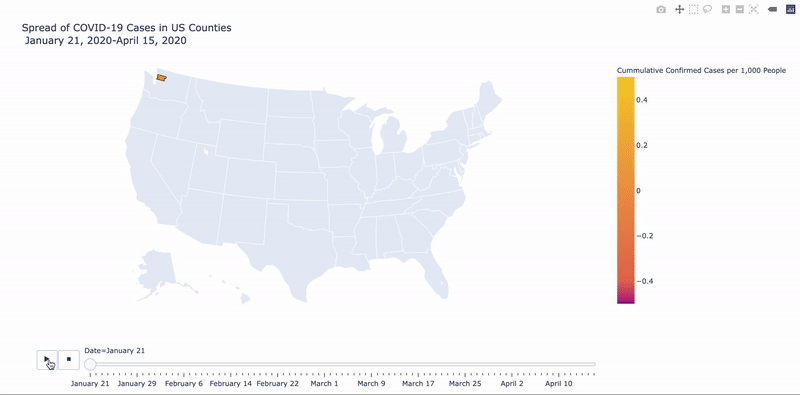
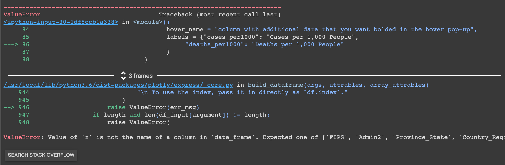

# Visualization of COVID-19 pandemic the US over time

How can we visualize and better understand the overall toll of the COVID-19 pandemic on US counties or county equivalents

## Business Question 
How can we, as leaders of the country, be able to look at the amount of cases of COVID-19 overtime in the US and understand to what degree it is spreading and impacting communites?

## Data Analysis
The Google Colaboratory Notebook was used to conduct this analysis. First, four packages were loaded. Then, the data was imported by connecting the source, Johns Hopkins Data. The data was then cleaned to allow for both a heat denisty map and bubble map and finished with a color denisty scale which changed by color there was a higher concentration of cases. This allowed a better visualization of the spread of COVID-19. 

The following is the graph of the data collection.*

*Conducted by Professor Shimano as the data was not fully able to compile 

## Business Answer 
How might our data visualizations help county and state leadership or business owners in the US? What other data might we want to incorporate into an animated choropleth map to better understand the toll of the novel coronavirus in the United States?

Data visualizations are extreamly important to county and state leadership of business owners in the US because it allows them to track accurately the spread of COVID-19. What can be seen by the map is that COVID-19 strated in top MSA's and then and spread quickly on both coasts. It was further creeped inward and consumed the entire country. At the same time the intial sites began seeing higher concentrations of people with COVID-19 followed by some cities having less prevalence as city officials to measures to slow the spread. What could be interesting to incorporate into the map to better understand the toll of the novel coronavirus in the United States is unddertand the bed count compared to the popualtion as this is a major resource that is necessary to slow spread. Also, PPE to popualtion might be interest to add. Overall, by having a animated choropleth map can help one quickly analzye a lot of data in a simple graphical form. 

## Error
The data was unable to complie shown in Google Colaboratory Notebook. Not sure what the value error/ syntax error could have been from. This happend when I was trying to add the optional part however, even if I did not include it, the error still persisited. 

